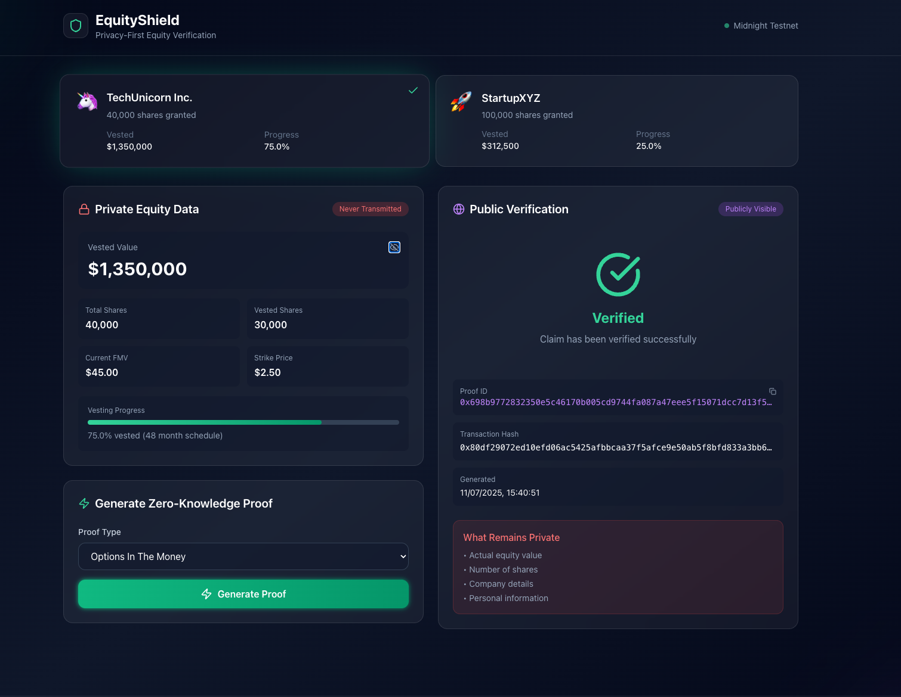

# EquityShield

<div align="center">
  
  
  
  
</div>

<div align="center">
  <h3>Privacy-First Equity Verification on Midnight Network</h3>
  <p>Prove your equity value without revealing sensitive cap table data using zero-knowledge proofs</p>
</div>

---


## Overview

EquityShield changes how startup employees verify their equity value during job negotiations. Using Midnight Network's zero-knowledge proof technology, professionals can prove claims about their equity (like having over $500k vested) without revealing actual values, company details, or violating NDAs.


> **💡 Note:** For this demonstration project, the application currently utilizes **mock data** to simulate equity grants and proof generation. This allows for a clear illustration of the UI/UX and the core privacy concepts of EquityShield without requiring direct integration with the Midnight SDK in this initial stage. The architecture section outlines how the real integration would function.

### The Problem

Startup employees face a privacy dilemma:

- 🔓 **Oversharing**: Must reveal exact equity values, company valuations, and vesting details
- 📄 **NDA Violations**: Risk breaking confidentiality agreements
- 💰 **Lost Leverage**: Lose negotiating power by exposing all financial details
- ⏱️ **Slow Verification**: Manual processes that delay job offers

### The Solution

EquityShield enables **selective disclosure** through zero-knowledge proofs:

- ✅ Prove claims without revealing underlying data
- 🔒 Keep sensitive information completely private
- ⚡ Generate instant, verifiable proofs
- 🛡️ Maintain NDA compliance

## 🎯 Key Features

1. **Complete Privacy Protection**: Your equity data never leaves your device. Using Midnight's witness pattern, all computations happen locally.

2. **Selective Disclosure**: Reveal only what you choose. Toggle visibility of your private data locally while keeping it secure from transmission.

3. **Multiple Proof Types**

- Options In The Money: Prove your options are profitable without revealing the strike price or current value.
- Threshold Verifications
- Set custom thresholds for various claims. Only the result is public.

### 4. **Instant Verification**

Generate cryptographic proofs in seconds that anyone can verify without seeing your private data.

## 🏗️ Architecture

EquityShield leverages Midnight Network's unique privacy architecture:

```
    ┌─────────────────┐     ┌─────────────────┐     ┌─────────────────┐
    │   Private Data  │────▶│   ZK Circuit    │────▶│  Public Proof   │
    │  (Local Only)   │     │  (Computation)  │     │   (Verified)    │
    └─────────────────┘     └─────────────────┘     └─────────────────┘
    Never                 Generates              Blockchain
    Transmitted              Proof                 Verified
```

### Key Components:

1. **Witnesses** (Private State)

- Access private equity data locally
- Never transmitted to the network
- Ensures complete privacy

2. **Circuits** (ZK Proof Generation)

- Generate cryptographic proofs
- Compute results without revealing inputs
- Powered by Midnight's ZK technology

3. **Ledger** (Public Verification)

- Store only proof results
- Enable public verification
- Maintain an immutable record

## Getting Started

### Prerequisites

- Node.js 18+ and npm
- Git

### Installation

1. **Clone the repository**

```bash
git clone https://github.com/olanetsoft/equityshield.git
cd equityshield
```

2. **Install dependencies**

```bash
npm install
```

3. **Run the development server**

```bash
npm run dev
```

4. **Open in browser**
   Navigate to [http://localhost:3000](http://localhost:3000)

### Production Build

```bash
npm run build
npm start
```

## 💻 Usage Guide

### 1. Select Your Equity Grant

Choose between different equity grants to demonstrate multiple scenarios.

### 2. View Private Data (Optional)

Click the eye icon to reveal your private equity details locally. This data never leaves your device.

### 3. Generate Proofs

Choose from various proof types:

- **Vested Value Above**: Prove your vested equity exceeds a threshold
- **Options In The Money**: Prove your options are profitable
- **Ownership Percentage**: Prove you own more than X% of the company
- **Vesting Progress**: Prove you've vested more than X%

### 4. Share Verification

Share the proof ID and transaction hash with verifiers. They can verify your claim without seeing any private data.

## 🎓 Use Cases

### For Job Seekers

- Prove equity value during salary negotiations
- Verify vesting status without revealing company details
- Demonstrate financial standing while maintaining privacy

### For Recruiters/Employers

- Verify candidate claims instantly
- Ensure competitive offers without overpaying
- Maintain candidate privacy and trust

### For Financial Services

- Verify equity for loan applications
- Assess financial standing without full disclosure
- Enable privacy-preserving financial products

## 🛡️ Privacy Guarantees

- **Local-Only Computation**: Private data never leaves your device
- **Zero-Knowledge Proofs**: Mathematical guarantees of privacy
- **Selective Disclosure**: You control what to prove
- **No Data Storage**: No private data stored on servers or blockchain

## 🔧 Technical Stack

- **Frontend**: Next.js 15, React 19, TypeScript
- **Styling**: Tailwind CSS 3.4
- **Icons**: Lucide React
- **Blockchain**: Midnight Network (testnet)
- **ZK Technology**: Midnight's Compact language and circuits

## 📁 Project Structure

```
equityshield/
├── components/          # React components
│   ├── EquityCard.tsx
│   ├── PrivateDataPanel.tsx
│   ├── ProofGenerator.tsx
│   └── ProofResult.tsx
├── lib/                # Core logic
│   └── mock/          # Mock services for demo
│       ├── types.ts
│       └── equityService.ts
├── pages/             # Next.js pages
│   ├── _app.tsx
│   └── index.tsx
├── styles/            # Global styles
│   └── globals.css
└── public/            # Static assets
```

## 🤝 Contributing

We welcome contributions! Please see our [Contributing Guidelines](CONTRIBUTING.md) for details.

1. Fork the repository
2. Create your feature branch (`git checkout -b feature/AmazingFeature`)
3. Commit your changes (`git commit -m 'Add some AmazingFeature'`)
4. Push to the branch (`git push origin feature/AmazingFeature`)
5. Open a Pull Request

## 📄 License

This project is licensed under the MIT License.


## 📞 Support & Documentation

- **Documentation**: [Midnight Developer Docs](https://docs.midnight.network)
- **Discord**: [Join our community](https://discord.gg/midnight)
- **Issues**: [GitHub Issues](https://github.com/olanetsoft/equityshield/issues)

---

<div align="center">
  <p>Built with ❤️ </p>
  <p>Empowering professionals to prove their worth while protecting their privacy</p>
</div>
